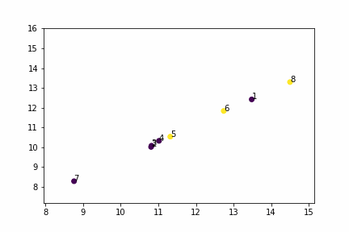

# simpleGNN
I applied Graph Neural Network (GNN) on self-made dataset

I designed a simple, easy-to-understand and small dataset like zachary's karate club. 

# dataset description
We have 8 individuals, each follow in Instagram cause an edge in our graph. 
which you can add value to each friendship too.
 - in feature matrix, first column shows number of posts, second one shows 'number of followers' and third one shows 'number of followings'

we want to predict if node 0 and node 7 split up, which nodes advocate either node 0 or node 7

